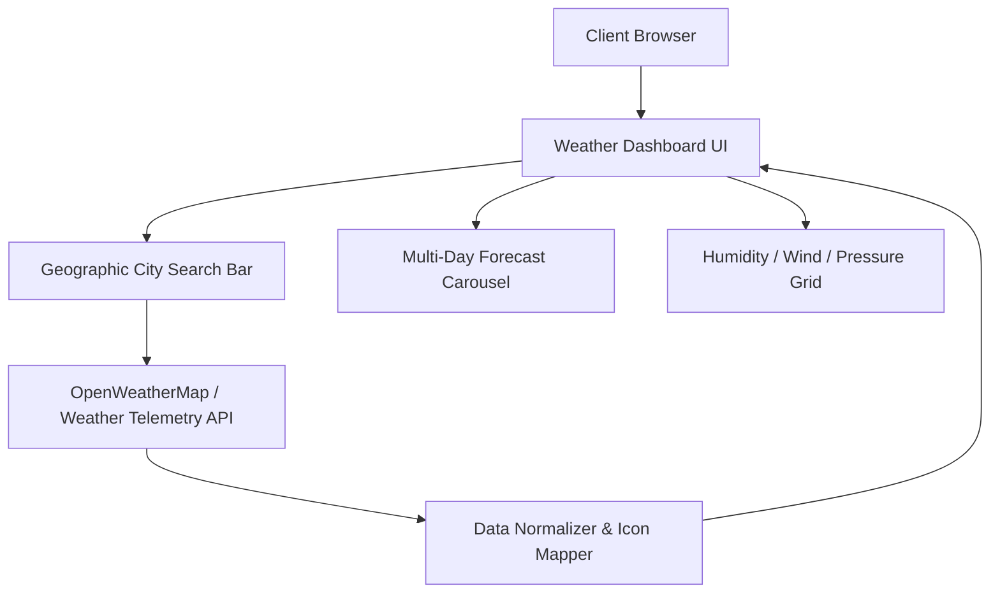

# Live Weather Radar & Meteorological Forecast

Interactive frontend weather application delivering real-time atmospheric telemetry, multi-day forecasting, geographic search, and weather state animations.



## Overview

Live Weather Radar provides real-time meteorological tracking for global locations. The application fetches current atmospheric conditions, temperature trends, precipitation probability, and wind metrics, presenting them in a responsive, data-dense layout.

### Capabilities

- **Real-Time Weather Metrics**: Current temperature, "feels like" metrics, relative humidity, atmospheric pressure, and wind speed.
- **Dynamic Condition Visuals**: Weather-reactive iconography and backgrounds reflecting clear, rainy, stormy, or snowy conditions.
- **Geographic Search**: Location search with input debouncing and fast query resolution.
- **Multi-Day Outlook**: Predictive daily forecasts with temperature highs and lows.

## Technology Stack

- **Frontend**: Semantic HTML5, CSS3 with responsive glassmorphism
- **Logic**: Vanilla ES6+ JavaScript, Fetch API, asynchronous promise handling

## Getting Started

Open `index.html` in your browser or run:

```bash
npx serve .
```
